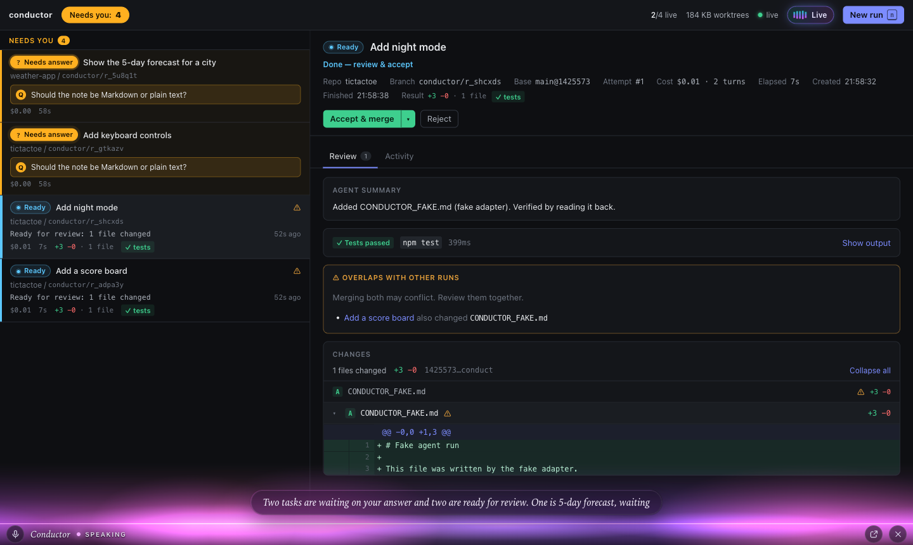
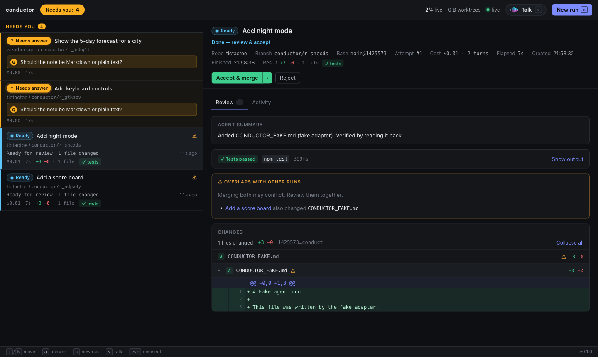
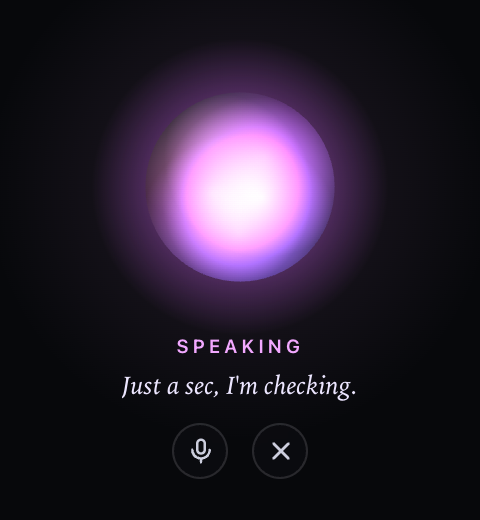

# conductor

One place to start, watch, and review headless coding-agent runs on your machine.

You give it a repo and a task. Each run gets its own git worktree and branch and a
Claude agent (via the Claude Agent SDK). The UI shows which runs need you: an agent
asking a question, a finished run to review, a merge conflict. You review the diff,
the agent's summary, and the test results, then accept (merge or keep the branch)
or reject (worktree and branch are removed). Runs and results survive a conductor
restart.

You can also run the whole app by voice. Talk to Conductor, and it answers, starts and
steers runs, merges after a spoken yes, and opens what it's talking about on screen.



| Review a finished run | Pop-out while you work elsewhere |
| --- | --- |
|  |  |

## Quick start

Requires Node ≥ 22.5, pnpm (via `corepack enable`), git ≥ 2.38, and a working
Claude Code login (`claude` works in your terminal).

```sh
pnpm install && pnpm start        # builds the UI, serves everything on http://127.0.0.1:4317
```

Want a repo to try it on? `pnpm demo:repo` creates `./.demo/sample-app`, a small JS
library with passing tests and a TODO list. TODO items 2 and 3 both edit
`src/slugify.js`, so running them in parallel shows the overlap warning and a
merge conflict on the second accept.

Development mode (server on 4317 with reload, Vite UI on http://localhost:5173):

```sh
pnpm dev
```

No agent credentials? `CONDUCTOR_AGENT=fake pnpm start` uses a scripted agent that
edits files, asks a question, and finishes, so you can explore every state for free.
The UI also has a server-less mock at `http://localhost:5173/?mock` under `pnpm dev`.

`pnpm test` runs the server suite (store, git against real temp repos, agent adapter,
supervisor). `CONDUCTOR_LIVE=1 pnpm test` adds three tests that call the real agent.

### Configuration

| Env | Default | |
|---|---|---|
| `CONDUCTOR_HOME` | `~/.conductor-runs` | SQLite DB, lockfile, worktrees |
| `CONDUCTOR_PORT` | `4317` | Binds to 127.0.0.1 only |
| `CONDUCTOR_MAX_CONCURRENT` | `4` | Live agents at once; the rest queue |
| `CONDUCTOR_TEST_TIMEOUT_MS` | `300000` | Test command timeout (process group is killed) |
| `CONDUCTOR_MAX_BUDGET_USD` | none | Per-run cost cap, checked between turns |
| `CONDUCTOR_MODEL` | SDK default | Model for agent runs |
| `CONDUCTOR_AGENT` | `claude` | `fake` for the scripted agent |
| `CONDUCTOR_PROJECTS_DIR` | none | Folder where your repos live. Pick repos by name, and create new projects there |
| `OPENAI_API_KEY` | none | Turns on voice. Read from the env or `.env` at the repo root |
| `CONDUCTOR_VOICE` | `marin` | GPT-Live voice |
| `CONDUCTOR_VOICE_MODEL` | `gpt-live-1` | Voice model |
| `CONDUCTOR_VOICE_AGENT_MODEL` | SDK default | Model for the voice orchestrator |

## Using it

- **New run** (`n`): type a project name to pick a repo from your projects folder
  (or recent ones, or type a path), and write the task. The repo is inspected live
  (branch, dirty state, detected test command); base branch and test command are
  under Options. Type a name that doesn't exist and pick **+ Create new project**:
  conductor makes `<projects folder>/<name>` as a git repo on `main` and starts the
  first task there. A new project gets one first task; once it's merged, run more in
  parallel. The test command is detected again after a run, so tests the agent adds
  get run.
- **Status**: every run has a state and a one-line activity like
  `Editing src/slugify.js` or `Running npm test`, derived from the agent's tool
  calls. No raw logs; the Activity tab has a readable timeline if you want detail.
- **Needs you**: runs are sorted by how much they need you. A question from the
  agent comes first, then conflicts, failures, interruptions, and finished runs.
  The tab title shows the count.
- **Blocked on a question**: the agent has an `ask_user` tool. The run goes to
  *waiting for input*, and you answer inline (`a`). You can also send a steering
  message to a running agent.
- **Review**: agent summary, test result with output, and the full diff (including
  new files). If another live run touches the same files, both show an overlap badge.
- **Accept & merge** creates a `--no-ff` merge commit on the base branch. **Keep
  branch only** leaves `conductor/<run-id>` for you to merge or open a PR. **Reject**
  deletes the worktree and branch.
- **Restart**: kill conductor any way you like and start it again. Runs that were
  live come back as *interrupted*; **Restart** resumes the same agent session.

### Voice

Press **Talk** (`v`) and talk to Conductor. Anything the app does, you can say:
"what needs me?", "start two tasks in tictactoe: add night mode, and a score
board", "start a new project called weather app: a CLI for the forecast",
"tell it Markdown", "what did the slugify one change?", "merge it", "show me
only what needs me". Conductor opens the task it's talking about on screen.

- If Conductor can't tell which repo you mean, it asks, or opens the New run window
  pre-filled for you to finish.
- Accept, reject, cancel, and creating a project ask first ("Merge Add night mode into main?") and only
  happen after a spoken yes.
- When a task starts needing you, Conductor mentions it in one line, never over
  anyone's speech, and offers to go into detail. Several at once become "two tasks
  need you".
- `m` mutes the mic. The dock shows who's talking, captions, and when Conductor is
  thinking.

Voice needs `OPENAI_API_KEY`; everything else works without it.

Presenting it? [docs/DEMO.md](docs/DEMO.md) is a 10-minute live demo script.

## Architecture

```
packages/
  shared/   run state machine, domain types, HTTP API contract, attention score
  server/   Fastify + node:sqlite
    store/        SQLite (WAL), versioned migrations, compare-and-set transitions
    git/          worktrees, diffs, test runner, merge
    agent/        Claude Agent SDK adapter, fake agent, activity line, process tagging
    supervisor/   scheduler, run lifecycle, recovery, reaper, overlap detection
    api/          REST + SSE
    voice/        GPT-Live session + sideband, orchestrator, confirmations, notices
  web/      React + Vite, one SSE stream, no client router
scripts/make-demo-repo.sh
```

**State machine.** `queued → starting → running ⇄ waiting_input → testing → ready →
accepting → accepted`, with `conflict`, `rejected`, `failed`, `cancelled`, and
`interrupted` off the main path. The allowed transitions live in
`shared/src/states.ts`. Every transition is `UPDATE … WHERE id = ? AND state IN
(…)`, so two callers (a double-clicked Restart, the scheduler, and recovery) can't
all win. That is what makes "never started twice" hold.

**Agent.** Each run is one `query()` session from the Claude Agent SDK with
streaming input, so answers and steering messages go into the same session.
`ask_user` is an in-process MCP tool whose handler waits for your answer; the
built-in `AskUserQuestion` is disabled. The agent runs with
`settingSources: []` so your personal hooks, plugins, and CLAUDE.md don't leak in.
Only `apiKeyHelper` and the `env` block from `~/.claude/settings.json` are passed
through, so gateway setups keep working.

**Process ownership.** The agent's CLI is spawned in its own process group, and
every descendant inherits `CONDUCTOR_RUN_ID=<id>`. Stopping a run kills the group,
then anything still carrying the tag. That covers a dev server the agent started
that escaped the group.

**Restart.** A lockfile keeps one conductor per data dir. A stale lock is taken
over. On boot, `recover()`:
1. kills recorded process groups (a pid is trusted only if its start time matches)
   and any process still tagged with a run id,
2. marks every live run `interrupted`, keeping its SDK session id,
3. puts `accepting` runs back to `ready` (the merge is a single CAS ref update, so
   it either happened or didn't),
4. prunes worktree dirs no run owns.

Restart moves `interrupted → queued` and resumes the session in the existing
worktree.

**Merge without touching your checkout.** Accept runs `git merge-tree
--write-tree` to compute the result in memory, `commit-tree` for the merge commit,
and `update-ref <base> <new> <old>` to move the branch only if it hasn't moved. If
the base branch is checked out in your working copy and it's clean, conductor
fast-forwards it. A conflict leaves everything untouched, lists the files, and the
run goes to `conflict`. From there you can retry the accept as keep-branch (resolve
it yourself) or reject.

**Cleanup.** Worktrees are removed on accept and reject. A periodic reaper retries
failed removals and deletes directories under the worktree root that no run owns.
It only touches directories named like a run id.

**Live updates.** `/api/stream` is SSE with named `run`, `event`, `system`, and
`voice` events. The client reconnects with backoff and catches up with `?after=<seq>`, so
a conductor restart shows as "reconnecting…" and then recovers without a reload.

**Voice.** The browser carries audio only: it sends its WebRTC offer to
`POST /api/voice/session`, and the server creates a `gpt-live-1` session with client
delegation (the OpenAI key never reaches the page). The server then attaches a
sideband WebSocket to the same session and owns everything else: the transcript,
delegations, and notices. Each delegation goes to an orchestrator, one warm
Agent SDK session per voice session, with no built-in tools and only conductor
tools that call the supervisor directly. It gets the latest transcript lines plus a
snapshot of the tasks, and its short reply goes back with `session.commentary.append`
for GPT-Live to speak. Destructive tools hand out a confirmation token, and the
action runs only if the token comes back within 60s after the user said yes out
loud; code checks this, not the prompt. Screen actions (`show_run`, `show_needs`)
reach the UI as `voice` SSE events. Design and API notes: [docs/VOICE_PLAN.md](docs/VOICE_PLAN.md).

## Trade-offs

- **Claude Agent SDK instead of wrapping the `claude` CLI.** Typed messages,
  resumable sessions, and in-process tools, at the cost of one agent vendor. The
  seam is `AgentAdapter` in `server/src/contracts.ts`; the fake agent is a second
  implementation.
- **`bypassPermissions`.** Agents run unattended in a worktree with full tool
  access. There's no per-command approval gate yet. The worktree limits accidental
  damage to the repo, not to the machine.
- **Activity line from tool calls, not an LLM.** Free, instant, and deterministic,
  but it says *what* the agent is doing, not *why*.
- **SQLite via `node:sqlite`.** No native build step. It's still flagged
  experimental in Node 22 (hence the startup warning).
- **Tests run once, by conductor, after the agent finishes**, using a detected or
  given command. The agent usually runs them too, but the result you review is the
  one conductor ran itself.
- **Single user, localhost only.** No auth. The server binds to 127.0.0.1.

See [docs/DECISIONS.md](docs/DECISIONS.md) for what was left out and what changes at scale.
